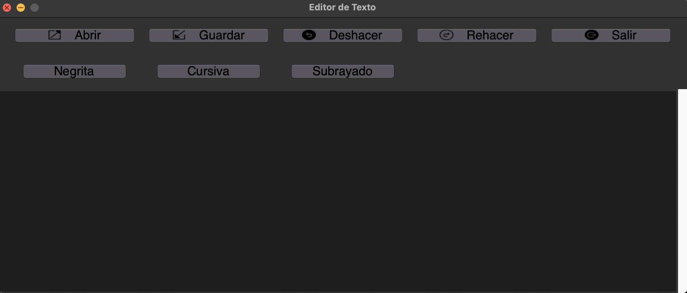
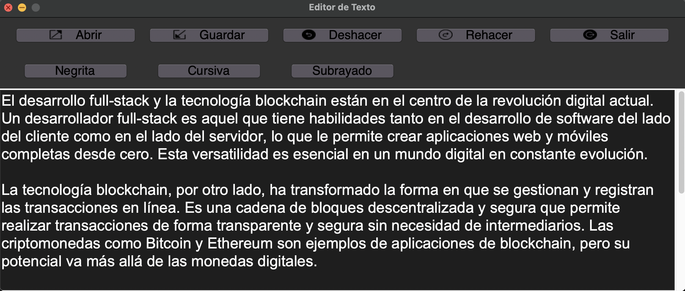
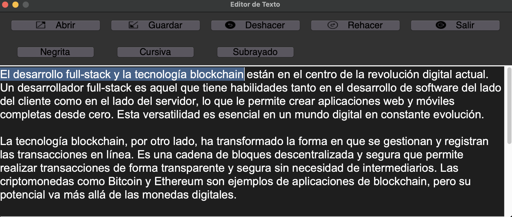
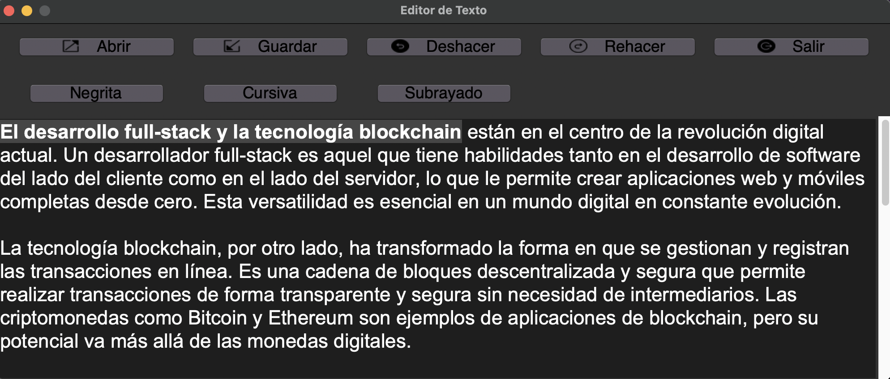
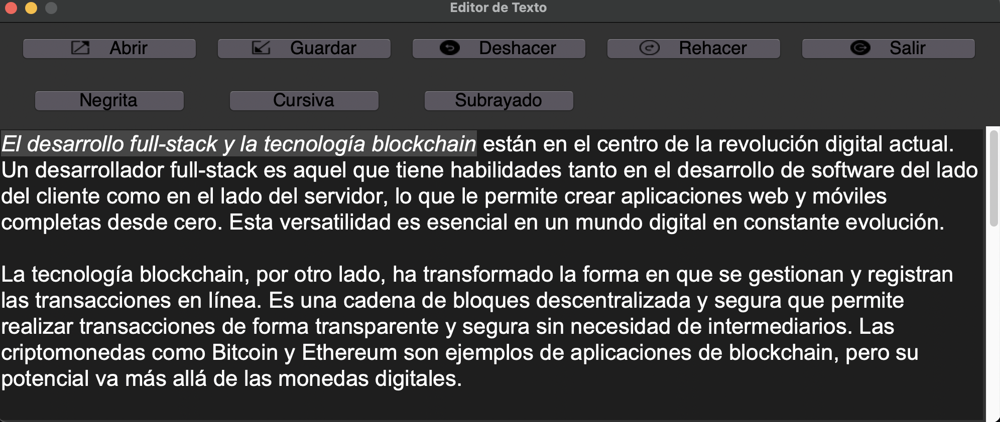
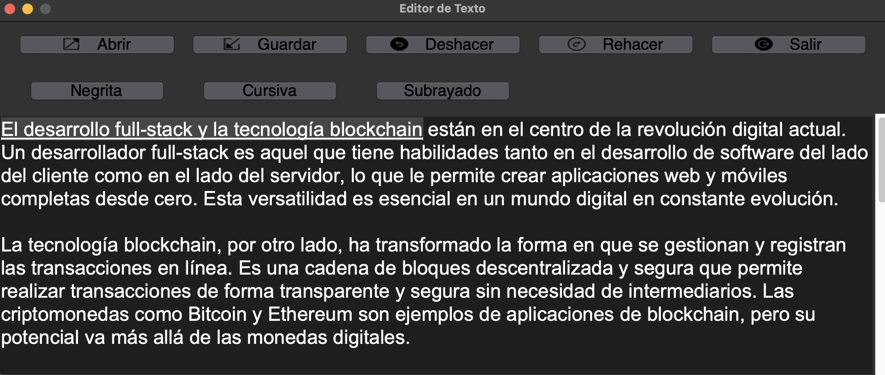
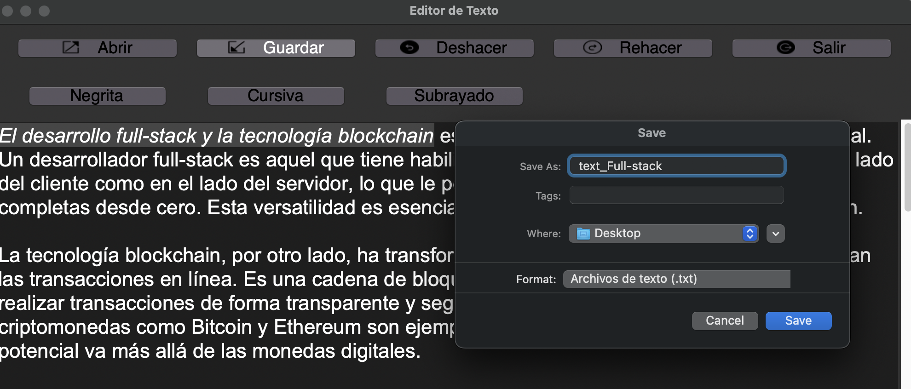
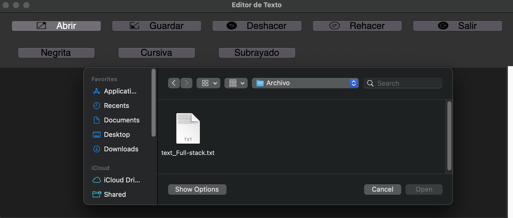

# Editor de Texto Versátil con Tkinter 📝✨

¡Bienvenido al Editor de Texto Versátil desarrollado en Python con la biblioteca Tkinter! Este editor está diseñado para simplificar tu experiencia de escritura, proporcionándote herramientas de edición intuitivas y flexibles.

### Interfaz de Inicio 🏠

Al abrir el editor, te recibirán con una interfaz amigable que te invita a comenzar a escribir de inmediato.

### Escribiendo en el Editor 🖋️

Escribe y edita tu texto de manera fluida y cómoda en el área de edición principal. La fuente, el tamaño y el estilo del texto son totalmente personalizables.

### Seleccionando Texto 🖱️

Selecciona texto con facilidad haciendo clic y arrastrando el cursor del ratón. Puedes aplicar formatos específicos o realizar operaciones en el texto seleccionado.

### Aplicando Negritas, Cursiva y Subrayado 🖼️

Para dar un toque especial a tu texto, hemos incluido botones de formato enriquecido:

- **Negritas** 🖼️: Haz clic en el botón "Negritas" para enfatizar tu texto.
 
- **Cursiva** 📜: Resalta partes importantes usando la cursiva.
 
- **Subrayado** 📌: Subraya elementos clave para mayor claridad.
 

### Deshacer y Rehacer ↩️🔁

Si cometes un error o deseas revertir cambios, el editor te permite deshacer y rehacer acciones con un solo clic. ¡Mantén tu flujo de trabajo sin problemas!

### Guardar y Abrir Archivos 💾📂

Tu trabajo es valioso. Por eso, puedes guardar el contenido en un archivo para futuras ediciones y abrir archivos existentes para continuar trabajando.

### Guardar

### Abrir Archivos

## Funciones Destacadas 🚀

- **Negritas, Cursiva y Subrayado:** Estas funciones de formato hacen que tu texto se destaque y sea más legible.

- **Deshacer y Rehacer:** Mantén el control total de tus ediciones, sin preocuparte por los errores accidentales.

- **Guardar y Abrir:** Tu trabajo siempre estará a salvo. Guarda y recupera documentos en cualquier momento.

## Requisitos 📦

Este proyecto se desarrolló utilizando Python y Tkinter. Asegúrate de tener instalados estos componentes en tu entorno de desarrollo.

## Cómo Usar 🚀

1. Clona este repositorio o descarga los archivos.

2. Ejecuta el programa utilizando Python.

3. Utiliza las funciones de edición y formato en la barra de herramientas y disfruta de la edición de texto eficiente.

## Contribuciones 🤝

¡Estamos abiertos a colaboraciones! Si encuentras errores o deseas añadir nuevas características, crea un "pull request" o presenta un problema. Tu contribución es valiosa.

## Licencia 📜

Este proyecto está bajo la Licencia MIT. Consulta el archivo `LICENSE` para obtener más información.

¡Esperamos que disfrutes utilizando este editor de texto versátil para potenciar tu escritura! 📝✨
